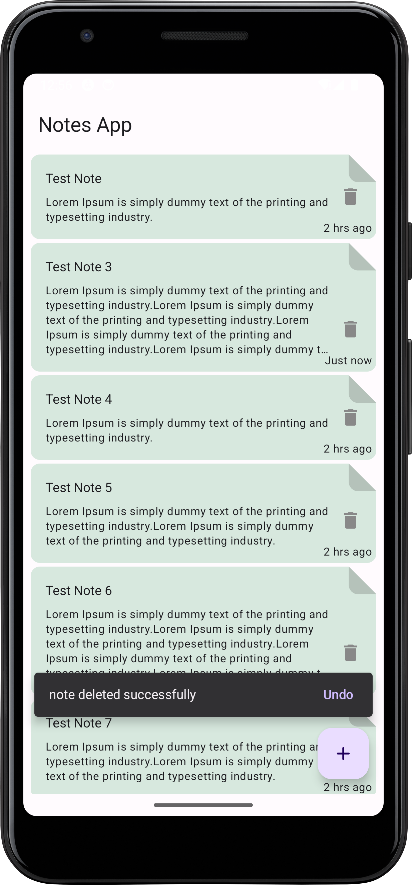

# Notes App

Notes is an Android application designed for efficient note management. It leverages modern
technologies like Dagger Hilt for dependency injection, Room Database for local data storage,
follows Clean Architecture principles, and utilizes Material Design components for a sleek user
interface.

## Download

## Features

- **Add Note**: Create new notes with ease.
- **Edit Note**: Modify existing notes directly within the app.
- **Delete Note**: Remove unwanted notes effortlessly.
- **List Note**: View all notes in a structured list format.

## Technologies Used

- **Dagger Hilt**: Dependency injection framework for easier testing and modularization.
- **Room Database**: Provides a robust local storage solution for persistent data.
- **Clean Architecture**: Separates concerns and enhances maintainability.
- **Material Design Components**: Ensures a modern and intuitive user interface.
- **Kotlin Symbol Processing (KSP)**: Efficient annotation processing for Kotlin.
- **Kotlin 2.0**: Utilizes the latest features and improvements in the Kotlin language.
- **Gradle.ktx**: Kotlin DSL for Gradle build scripts, enhancing build logic readability.
- **Jetpack Compose**: Android’s recommended modern toolkit for building native UI

## Screenshots

 

<em>Add, edit, and delete notes seamlessly.</em>

    
    
    
    

<em>List of notes displayed in a clean interface.</em>

  

